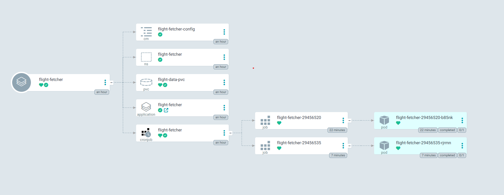

# MYOL-neer

Flight ticket price dataset builder using Google Flights via the fast-flights library.

## Features

- Fetches real-time flight prices from Google Flights
- No API keys required - uses web scraping
- Supports multiple routes and date ranges
- Exports data to CSV with standardized schema
- Configurable seat class filters (economy, premium-economy, business, first)
- Rate limiting and error handling with retry logic

## Important: Regional Restrictions

**Google Flights displays a cookie consent dialog for EU users**, which can block automated scraping. If you encounter errors mentioning "Before you continue to Google" or cookie consent, you have these options:

1. **Run from a non-EU server** (e.g., AWS US-East, DigitalOcean NYC)
2. **Use a VPN/proxy** from a non-EU country
3. **Use a residential proxy service** like BrightData (supported in fast-flights v3)

## Dataset Schema

| Field | Description |
|-------|-------------|
| `origin` | IATA airport code of departure |
| `destination` | IATA airport code of arrival |
| `departure_date` | Flight departure date (YYYY-MM-DD) |
| `query_date` | Date when price was queried (YYYY-MM-DD) |
| `days_before_departure` | Days between query and departure |
| `airline` | Airline name |
| `price` | Total ticket price |
| `currency` | Price currency code (e.g., USD, EUR) |
| `stops` | Number of stops (0 = direct) |
| `flight_duration` | Total flight duration in minutes |
| `cabin` | Cabin class (ECONOMY, PREMIUM_ECONOMY, BUSINESS, FIRST) |
| `offer_rank` | Price ranking (1 = cheapest) |
| `departure_time` | Departure time |
| `arrival_time` | Arrival time |
| `source` | Data source identifier ("google_flights") |

## Setup

### Option A: Docker (Recommended)

1. Run with Docker Compose:

```bash
docker compose up --build
```

Data will be saved to the `./data` directory on your host.

### Option B: Kubernetes with ArgoCD (GitOps)

Deploy to Kubernetes using ArgoCD for automated GitOps-style continuous delivery.

1. **Apply the ArgoCD Application:**

```bash
kubectl apply -f k8s/argocd-application.yaml
```

ArgoCD will automatically sync and deploy all resources from the `k8s/` directory:
- **Namespace** - Isolated `flight-fetcher` namespace
- **CronJob** - Runs the fetcher every day at 9:00 AM
- **ConfigMap** - Flight search configuration
- **PersistentVolumeClaim** - 1GB storage for CSV data

The deployment uses automated sync with self-healing, so any manual changes will be reverted to match the Git repository.



2. **Using the Kubeconfig:**

Set the `KUBECONFIG` environment variable to use the production cluster:

```bash
# Set KUBECONFIG environment variable
export KUBECONFIG=./k8s/kubeconfig.yaml

# Verify connection
kubectl get nodes

# Check pods in the flight-fetcher namespace
kubectl get pods -n flight-fetcher

# View CronJob status
kubectl get cronjobs -n flight-fetcher

# Check logs from the latest job
kubectl logs -l app=flight-fetcher -n flight-fetcher --tail=100
```

Or use the `--kubeconfig` flag directly:

```bash
# Apply all manifests
kubectl --kubeconfig=./k8s/kubeconfig.yaml apply -f k8s/

# Watch pods
kubectl --kubeconfig=./k8s/kubeconfig.yaml get pods -n flight-fetcher -w
```

> ⚠️ **Security Note**: The `kubeconfig.yaml` file contains sensitive credentials and is excluded from Git via `.gitignore`. Never commit this file to version control.

### Option C: Local Python

#### 1. Install Dependencies

```bash
pip install -r requirements.txt
```

#### 2. Install Playwright (Required for local mode)

```bash
pip install playwright
playwright install chromium
```

## Configuration

All settings are managed via **`config.yaml`** in the project root. Edit this file to customize your flight searches.

### Configuration Structure

```yaml
# Fetcher Settings
fetcher:
  request_delay: 2.0    # Seconds between requests
  max_retries: 3        # Retry attempts on error
  retry_delay: 10       # Base delay before retry (exponential backoff)
  mode: "local"         # "common" or "local"

# Search Parameters
search:
  max_offers_per_search: 20
  seat_class: "economy"   # economy, premium-economy, business, first
  adults: 1
  children: 0
  currency: "EUR"

# Date Range Settings
date_range:
  start_days: 1         # Days from today to start
  end_days: 7           # Days from today to end
  step: 1               # Interval between dates

# Routes to Search (IATA airport codes)
routes:
  - ["CDG", "AMS"]      # Paris to Amsterdam
  - ["CDG", "MAD"]      # Paris to Madrid
  - ["LHR", "CDG"]      # London to Paris

# Output Settings
output:
  directory: "data"
  file_prefix: "flight_prices"
```

### Modes

The `mode` parameter controls how requests are made:

| Mode | Description |
|------|-------------|
| `common` | Direct HTTP requests (fastest, but may hit consent walls) |
| `local` | Uses local Playwright browser (handles JavaScript, slower but more reliable) |

## Usage

### Test the API

First, run the test script to verify the library works from your location:

```bash
python test_flight.py
```

### Run with Config

The main script reads all settings from `config.yaml`:

```bash
python flight_price_fetcher.py
```

This will:
- Load routes and settings from `config.yaml`
- Fetch prices for configured date range
- Save results to `data/flight_prices_YYYYMMDD_HHMMSS.csv`

### Programmatic Usage

```python
from flight_price_fetcher import GoogleFlightsFetcher, generate_date_range

# Initialize fetcher
fetcher = GoogleFlightsFetcher(
    request_delay=2.0,  # seconds between requests
    mode="local"        # uses local Playwright browser
)

# Define custom routes
routes = [
    ('LHR', 'CDG'),  # London to Paris
    ('FRA', 'AMS'),  # Frankfurt to Amsterdam
]

# Generate dates for next 30 days
dates = generate_date_range(start_days=1, end_days=30, step=3)

# Fetch offers
offers = fetcher.fetch_multiple_routes(
    routes=routes,
    departure_dates=dates,
    seat_class='business',  # Optional: filter by cabin
    max_offers_per_search=10
)

# Save to CSV
fetcher.save_to_csv(offers, 'my_dataset.csv')
```

### Single Route Query

```python
offers = fetcher.fetch_flight_offers(
    origin='JFK',
    destination='LAX',
    departure_date='2025-01-15',
    adults=1,
    seat_class='economy',
    max_offers=50
)
```

### Using fast-flights Directly

```python
from fast_flights import FlightData, Passengers, create_filter, get_flights_from_filter

# Create flight data
flight_data = FlightData(
    date="2025-01-15",
    from_airport="JFK",
    to_airport="LAX"
)

# Create passengers
passengers = Passengers(adults=1, children=0, infants_in_seat=0, infants_on_lap=0)

# Create filter
flight_filter = create_filter(
    flight_data=[flight_data],
    trip="one-way",
    passengers=passengers,
    seat="economy",
)

# Get flights
result = get_flights_from_filter(flight_filter, mode="local")

print(result)
```

## Rate Limiting

To avoid being blocked by Google:
- Default delay of 2 seconds between requests
- Automatic retry with exponential backoff on errors
- Consider increasing `request_delay` in config for large batch jobs

## Troubleshooting

### Cookie Consent Wall (EU Users)

If you see errors like "Before you continue to Google", you're hitting the EU cookie consent wall. Solutions:

1. **Use a US-based cloud server** (AWS, DigitalOcean, etc.)
2. **Use a VPN** connected to a US server
3. **Upgrade to fast-flights v3** and use a proxy service

### Timeout Errors

If requests are timing out:
- Increase `request_delay` in config to 5+ seconds
- Try switching `mode` to `"local"`
- Check your internet connection

### Config Not Found

If you see "Config file not found":
- Ensure `config.yaml` exists in the project root
- Or pass a custom path: modify the `main()` call

## License

MIT
